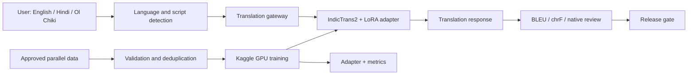

# Santali AI

> **Open-source language technology for Santali and Ol Chiki.**

[](https://santali-ai-dashboard.vercel.app)
[](https://www.kaggle.com/code/janaiworkspace/santali-ai-translation)
[](https://github.com/murmusuvash2-wq/santali-ai)

**[Open the live project dashboard →](https://santali-ai-dashboard.vercel.app)**

Santali AI is a transparent, data-first research project for building useful Santali language tools. The first milestone is reliable English–Santali translation in **Ol Chiki**, followed by a grounded conversational assistant and speech capabilities.

> **Project note:** This is research software. Training is being performed on Kaggle GPU infrastructure, with model quality evaluated using automated metrics and native-speaker review before any public release.

## What is happening now?

The current pipeline prepares an approved English–Santali parallel corpus, uploads private training inputs to Kaggle, attaches IndicTrans2, and runs a LoRA adaptation experiment.

| Area | Current state |
|---|---|
| Live project dashboard | [Open dashboard](https://santali-ai-dashboard.vercel.app) |
| Training platform | Kaggle GPU |
| Base model | `ai4bharat/indictrans2-en-indic-dist-200M` |
| Translation direction | English → Santali (`eng_Latn` → `sat_Olck`) |
| Training method | LoRA adapter fine-tuning |
| Parallel corpus | 19,869 approved English–Santali pairs |
| Dataset visibility | Private while provenance is reviewed |
| Kernel | [janaiworkspace/santali-ai-translation](https://www.kaggle.com/code/janaiworkspace/santali-ai-translation) |

Hinglish mein: **data preparation aur model upload automatic hai; Kaggle GPU queue mein aane ke baad training kernel run hota hai.** Dashboard se project ka overall progress dekha ja sakta hai.

## Project vision

Santali speakers ke liye practical, accessible aur community-reviewed language technology banana:

```text
Translation → Knowledge assistant → Speech → Mobile and messaging tools
```

### Roadmap

| Phase | Deliverable | Status |
|---|---|---|
| 1 | English/Hindi ↔ Santali text translation | In progress |
| 2 | Santali knowledge assistant with retrieval | Planned |
| 3 | Santali ASR and TTS voice pipeline | Planned |
| 4 | Telegram, WhatsApp and offline Android access | Planned |

## Architecture



## Data and provenance

The first experiment uses the [English–Santali Mod4 corpus](https://huggingface.co/datasets/aiswarya9302/english-santali-datasetmod4). The current automated preparation step downloads the train, validation and test files, normalizes the schema, removes duplicate pairs, and creates a private Kaggle dataset.

| Property | Value |
|---|---|
| Source | English–Santali Mod4 |
| Records | 63,179 pairs |
| Script | Santali in Ol Chiki |
| Source field | `src` |
| Target field | `tgt` |
| Training schema | `source`, `target`, `source_lang`, `target_lang` |
| Source license | Currently unclear; private use only pending confirmation |

The dataset is **not being redistributed publicly** until the original provenance and license are confirmed. FLORES+ is reserved for held-out evaluation and is not used as training data.

## Repository structure

```text
.
├── README.md
├── CONTRIBUTING.md
├── LICENSE
├── CITATION.cff
├── configs/
│   ├── data_sources.yaml
│   └── translation_lora.yaml
├── data/                         # Local data placeholders; downloads are ignored
├── diagrams/
│   └── architecture.mmd
├── docs/
│   ├── PLAN.md
│   ├── LOW_RESOURCE_ENGINEERING_STANDARD.md
│   ├── POST_TRAINING_VALIDATION_PLAN.md
│   ├── DATA_POLICY.md
│   ├── DATA_SOURCE_REVIEW.md
│   ├── EVALUATION.md
│   ├── GITHUB_KAGGLE.md
│   └── KAGGLE.md
├── kaggle/kernel/
│   ├── kernel-metadata.json
│   ├── requirements-kaggle.txt
│   └── train.py                  # Self-contained Kaggle entrypoint
├── scripts/
│   ├── prepare_mod4_kaggle_dataset.py
│   ├── validate_parallel.py
│   ├── normalize_olchiki.py
│   └── split_parallel.py
└── training/
    ├── kaggle_prepare_data.py
    └── kaggle_translation_lora.py
```

## Quick start

```bash
git clone https://github.com/murmusuvash2-wq/santali-ai.git
cd santali-ai
python -m venv .venv
source .venv/bin/activate
pip install -r requirements.txt
```

Validate a local parallel CSV:

```bash
python scripts/validate_parallel.py \
  --input data/raw/parallel.csv \
  --output data/interim/parallel_validated.csv

python scripts/split_parallel.py \
  --input data/interim/parallel_validated.csv \
  --output-dir data/processed
```

## Kaggle training flow

The GitHub Actions workflow handles the repeatable parts:

1. Check Kaggle and Hugging Face credentials.
2. Prepare the approved parallel dataset.
3. Create or update the private Kaggle data input.
4. Download IndicTrans2 using `HF_TOKEN`.
5. Create or update the private model input.
6. Attach both inputs to the Kaggle kernel.
7. Push the kernel with an Nvidia T4 GPU.
8. Save the LoRA adapter and evaluation artifacts.

Run it manually from **GitHub → Actions → Kaggle training → Run workflow**. Required repository secrets are `KAGGLE_API_TOKEN` and `HF_TOKEN`; Telegram notification is optional.

## Low-resource Santali standard

This project does not treat Santali like a high-resource translation task. The mandatory engineering standard covers Ol Chiki Unicode and script validation, rights-aware data provenance, tokenizer fragmentation, mixed Santali–Hindi–Bengali routing, numerical finite-logit preflight, leakage prevention, native-speaker review, and fail-closed Kaggle/GitHub reporting. Read the [Low-Resource Santali Engineering Standard](docs/LOW_RESOURCE_ENGINEERING_STANDARD.md) before changing model, data, tokenizer, or training code. Contribution requirements are in [CONTRIBUTING.md](CONTRIBUTING.md).

## What happens after a successful training run?

Training completion is not the same as translation quality approval. The next steps are documented in the [Post-Training Validation and Integration Plan](docs/POST_TRAINING_VALIDATION_PLAN.md):

1. Audit tokenizer fragmentation and Ol Chiki coverage.
2. Evaluate held-out translations from the base and LoRA models.
3. Benchmark the same test set against NLLB-200.
4. Validate approved datasets, rights, deduplication and mixed-language routing.
5. Decide whether another fine-tuning run is needed.
6. Begin internal-only Gemma–IndicTrans bridge testing after the quality gates pass.

The current successful Kaggle run is therefore treated as a **validated training artifact candidate**, not as an automatic public release.

## Quality and release gates

A model will not be called production-ready until it passes all of the following:

- No sentence or speaker leakage between train and evaluation sets.
- Unicode and Ol Chiki script validation.
- Tokenizer-health audit and finite encoder/decoder/lm-head preflight.
- BLEU and chrF reported on a held-out test set.
- Mixed Santali, Hindi, Bengali and English stress tests.
- Native-speaker adequacy and fluency review.
- Safety tests for medical, agriculture, hate, privacy and unknown questions.
- Dataset source, license, consent and transformation records.
- Clear model card describing limitations and intended use.

## Open-source principles

**Transparency:** training data, scripts and decisions are documented.

**Community review:** native Santali speakers are part of the evaluation loop.

**Responsible release:** unclear-license or consent-sensitive data remains private.

**Practical access:** the long-term goal is useful tooling through web, mobile and messaging interfaces—not only a benchmark score.

## Useful links

- **Live dashboard:** https://santali-ai-dashboard.vercel.app
- **GitHub repository:** https://github.com/murmusuvash2-wq/santali-ai
- **Dashboard source:** https://github.com/murmusuvash2-wq/santali-ai-dashboard
- **Kaggle kernel:** https://www.kaggle.com/code/janaiworkspace/santali-ai-translation
- **Dataset source:** https://huggingface.co/datasets/aiswarya9302/english-santali-datasetmod4
- **IndicTrans2:** https://github.com/ai4bharat/IndicTrans2

## Contributing

Contributions are welcome, especially native-speaker corrections, licensed Santali text, evaluation examples, Ol Chiki normalization rules, documentation improvements and reproducible experiments. Read [CONTRIBUTING.md](CONTRIBUTING.md) and open an issue before adding a new dataset so that provenance and licensing can be reviewed first.

## License

The software in this repository is released under the [MIT License](LICENSE). Individual datasets and model weights retain their own licenses and terms; consult the relevant source before reuse.

This project is research software. Model outputs are not medical, legal or emergency advice.
